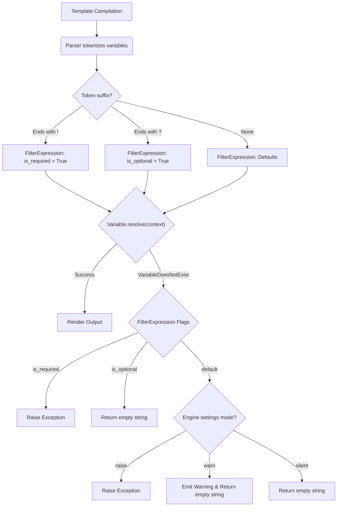
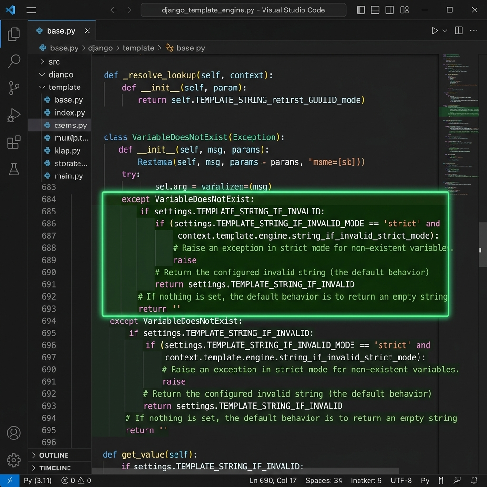
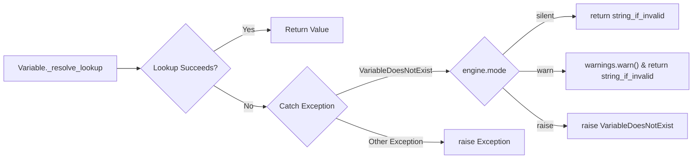

# Django Template Variables: Ergonomic Control Over Missing Context
**Google Summer of Code 2026 Proposal — Django Software Foundation**

## Personal & Contact Information
| Field | Value |
|---|---|
| **Full Legal Name** | Vaibhav Pandey |
| **Preferred Name** | Vaibhav |
| **Email** | aryanpandey392@gmail.com |
| **GitHub** | [@alphacoder-hash](https://github.com/alphacoder-hash) |
| **Django Forum** | [@alphacoder-hash](https://forum.djangoproject.com) |
| **Timezone** | IST (UTC+5:30) |
| **Reference Issue** | [django/new-features#5](https://github.com/django/new-features/issues/5) |

---

## 1. Synopsis
Django's template engine is praised for its fault tolerance; if a template references a variable that doesn't exist, Django silently substitutes it with an empty string. While this prevents minor typographical errors from crashing production pages, it introduces an insidious class of bugs: **invisible failures**. A misspelled variable (`{{ user.nmae }}`) renders blank space, silently bypassing CI checks and entering production undetected.

This project implements a backward-compatible system giving developers ergonomic control over missing variable behaviour. It introduces a `string_if_invalid_mode` engine setting, granular syntax markers (`{{ var! }}` / `{{ var? }}`), and a `` block tag. Crucially, **no existing templates will break**. The default mode remains silent, preserving 100% backward compatibility for the global Django ecosystem.

---

## 2. Benefits to the Django Community
Currently, Django's template engine swallows exceptions for missing variables entirely. This proposal brings massive benefits to the organization and wider open-source ecosystem:
- **Major Debugging Improvements:** Developers will no longer waste hours tracing why a template rendered blank HTML. Failing fast with `raise` in development saves countless debugging hours.
- **Fail-Safe Testing & CI/CD:** By using the `warn` mode in testing, CI pipelines can catch template typos before they ever reach production.
- **Documenting Developer Intent:** Template authors can explicitly assert their assumptions using `{{ var! }}` and ``, enforcing contract-like data structures directly inside HTML.
- **Staying Competitive:** This matches the expected strictness of modern engines (like Jinja2) without sacrificing Django's traditional ease-of-use. 

---

## 3. Related Work
It is important to understand how other template engines handle context resolution:
- **Jinja2:** Raises an `UndefinedError` by default when variables are missing. It offers a configurable `Undefined` class to change this behaviour.
- **Mako:** Raises a standard Python `NameError` by default.
- **Handlebars / Mustache:** Fails silently with an empty string, similar to current Django.

Some third-party Django packages (like `django-strict-templates`) have attempted to hack around the Django engine by deeply subclassing the parser. However, because `VariableDoesNotExist` is caught fundamentally deep inside `django.template.base.Variable`, third-party patches are often fragile and easily broken by Django core updates. Implementing this natively inside `django/template/engine.py` is the only robust, maintainable solution.

---

## 4. Deliverables & Required Work Breakdown

Below is a clear work breakdown structure denoting requirements, investigation, coding, and documentation phases. 

**Required Deliverables:**
- **[Investigation]** Architectural Finalization: Confirm syntax naming (e.g., `required_vars` vs `assert_vars`) with mentors prior to implementation.
- **[Coding]** Engine Settings: Implementation of `string_if_invalid_mode` (`silent`, `warn`, `raise`).
- **[Coding]** Syntax Markers: Token parsing for `!` (required) and `?` (optional) modifiers inside `FilterExpression`.
- **[Coding]** Block Tag: Implementation of the `` node.
- **[Testing]** 100% test coverage using Django's template test suite avoiding any performance regression.
- **[Documentation]** Full standard documentation for `docs/ref/templates/api.rst` and `docs/ref/templates/builtins.rst`.

**Optional Deliverables:**
- **[Coding]** Extending `string_if_invalid_mode` logging support to Django's built-in `Jinja2Backend` wrapper for ecosystem parity.
- **[Documentation]** Creating an advanced tutorial section: "Debugging Template Errors".

---

## 5. Technical Implementation Plan

The core implementation requires modifying the engine initialization, intercepting variable resolution logic, and parsing new syntax markers.

### Django Template Resolution Architecture



### Phase 1: Engine-Wide `string_if_invalid_mode`

```python
# The Engine __init__ will be extended to parse the new keyword argument.
class Engine:
    def __init__(self, ..., string_if_invalid_mode='silent', ...):
        # Validation logic ensuring mode is 'silent', 'warn', or 'raise'
        self.string_if_invalid_mode = string_if_invalid_mode
```

**Intercepting Variable Resolution (`django/template/base.py`)**





```python
# Pseudocode representation of the interception logic:
def _resolve_lookup(self, context):
    try:
        # Standard lookup chain sequence...
    except Exception as e:
        if isinstance(e, VariableDoesNotExist):
            # NEW: Branch based on engine.string_if_invalid_mode
            if mode == "raise": raise e
            if mode == "warn":  warnings.warn("Missing variable")
            return placeholder_string
        raise e
```

### Phase 2: Per-Variable Syntax Markers (`!` and `?`)

To allow granular, template-level overrides (e.g. `{{ invoice.total! }}`), the token parser must be updated.

```python
class FilterExpression:
    def __init__(self, token, parser):
        # We will parse trailing '!' and '?' markers from the token 
        # and set internal flags before passing the rest to Variable.
        self.is_required = token.endswith("!")
        self.is_optional = token.endswith("?")

def resolve(self, context, ignore_failures=False):
    # During exception handling, local flags take precedence over the engine defaults.
    if self.is_required: raise
    if self.is_optional: return ""
    # Else fallback to default engine intercept...
```

### Phase 3: the `` Block Tag

```python
class RequiredVarsNode(Node):
    def render(self, context):
        # Loops over all requested context variables.
        # If any fail to resolve, they are grouped and a single 
        # VariableDoesNotExist exception is raised listing all missing keys.
        return "" # Validates context but renders nothing to the DOM
```

---

## 6. Project Timeline

**Community Bonding (Until May 24, 2026)**
- **Investigation:** Refine the variable parsing rules on the Django Forum Mentors channel.
- Discuss the performance profiling requirements for the `silent` mode fallback.

**Weeks 1-2: Test-Driven Foundation**
- **Coding:** Write the failing test suite (`tests/template_tests/test_missing_vars.py`) demonstrating all expected behaviours before writing implementation code. Check performance baselines.

**Weeks 3-4: Implement `string_if_invalid_mode` Setting**
- **Coding:** Implement Engine `__init__` parsing, exception catching in `Variable._resolve_lookup`, and emit warnings. Submit draft PR.

**Weeks 5-6: Implement Syntax Markers (`!` and `?`)**
- **Coding:** Extend the `FilterExpression` parser. Handle complex nested dictionary references (`{{ user.profile.bio! }}`).

**Week 7: Midterm Evaluation**
- Consolidate and refine Parts 1 and 2 based on Mentor review.

**Weeks 8-9: Implement `` Block Tag**
- **Coding:** Build `RequiredVarsNode` and register the tag. 

**Week 10: Documentation Sprint**
- **Documentation:** Document modes in `docs/ref/templates/api.rst` and new syntax in `docs/ref/templates/builtins.rst`.

**Week 11: Performance Audit & Edge Case Review**
- **Investigation & Coding:** Run extensive `timeit` profiling. Ensure `"silent"` mode shows strictly zero overhead against Django `main`.

**Week 12: Final Polish & Conclusion**
- Address final Python styling and review comments. Submit GSoC 2026 evaluations.

---

## 7. Biographical Information

**Who Am I?**
I am Vaibhav Pandey, a passionate Python developer and computer science student. My academic focus combines software engineering principles with robust backend infrastructure, giving me a solid theoretical and practical background for contributing to large-scale frameworks.

**Skills & Experience:**
- **Languages:** Python (Fluent), JavaScript, SQL.
- **Frameworks:** Highly experienced with Django (Models, ORM, Views, Template Engine).
- **Open Source:** I have a background in reading through Python internals and have specifically audited the `django/template/base.py` module to prepare for this GSoC project.

**Why Django?**
I frequently use Django for my personal, university, and enterprise-grade projects. I have personally lost hours debugging typos in templates that failed silently, which is why I am intimately familiar with the pain-point this proposal addresses. 

### Outside Time Commitments
- **Available Hours:** 35-40 hours per week.
- **Other Commitments:** I have carefully inventoried my time. My university term concludes right before the coding period begins, meaning I have no conflicting academic classes, credit-hour instructions, or part-time jobs during the primary GSoC timeline. 
- I will be treating GSoC as a full-time summer internship. I have a continuous, reliable internet connection and will be continuously reachable via the Django Discord, Mailing List, or specific Mentor comms.
