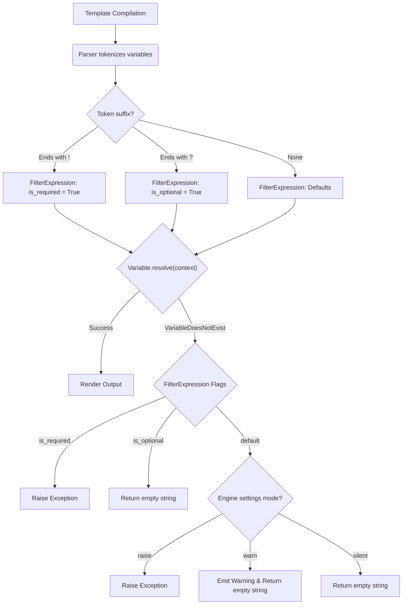
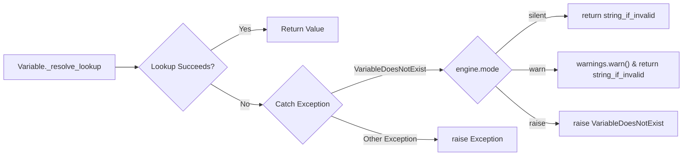

# GSoC 2026 Proposal: Ergonomic Control Over Missing Variables in Django Templates
**Django Software Foundation**

| Field | Value |
|---|---|
| **Candidate** | Vaibhav Pandey |
| **Email** | aryanpandey392@gmail.com |
| **GitHub** | [@alphacoder-hash](https://github.com/alphacoder-hash) |
| **Django Forum** | [@alphacoder-hash](https://forum.djangoproject.com) |
| **Project Size** | Large — 350 Hours |
| **Difficulty** | Medium |
| **Reference Issue** | [django/new-features#5](https://github.com/django/new-features/issues/5) |

---

## 1. Abstract

Django's template engine is famous for its fault tolerance. By design, if a template references a variable that doesn't exist in the context, Django silently substitutes the missing variable with an empty string (`""`). While this design prevents minor template errors from crashing production pages, it introduces a severe class of bugs: **invisible failures**. A typo in a variable access (e.g., `{{ user.nmae }}`) renders blank space, silently bypassing CI checks and entering production undetected.

This project implements a complete, backward-compatible system giving developers ergonomic control over missing variable behaviour. The deliverables are:

1. A new `string_if_invalid_mode` engine setting (`silent`, `warn`, `raise`).
2. Per-variable syntax markers (`{{ var! }}` for required, `{{ var? }}` for optional).
3. A `` block tag for section-level enforcement.

Crucially, **no existing templates will break**. The default mode remains `"silent"`, preserving 100% backward compatibility for the global Django ecosystem.

---

## 2. Problem Statement & Motivation

### 2.1 The Silent Failure Lifecycle
Every Django developer knows this story:
1. `views.py` passes `{"user": user_obj}` to the template.
2. The template author types `{{ usr.first_name }}` (a typo).
3. The page renders with a 200 OK status. 
4. The bug ships. Users see a blank greeting: `Welcome, !`.

### 2.2 Why `string_if_invalid` is Insufficient
Currently, `TEMPLATES[0]['OPTIONS']` accepts a `string_if_invalid` parameter. However, this is largely ineffective for debugging because:
- **It is all-or-nothing:** You cannot mark a specific variable as required.
- **It cannot raise an exception:** It only outputs a placeholder string (e.g., `"INVALID"`), ruining the DOM instead of failing fast.
- **No template-level intent:** Template authors cannot assert requirements declaratively inside the HTML file.

For context, **Jinja2** raises an `UndefinedError` by default when variables are missing, and **Mako** raises a `NameError`. Django is unique in offering absolutely no path to strict context validation.

---

## 3. Technical Implementation Plan (From Scratch to End)

The core implementation requires modifying the engine initialization, intercepting variable resolution logic, parsing new syntax markers, and creating a new template node. Below is the exact step-by-step technical plan for integrating this into Django's core without regressions.

### Django Template Resolution Architecture



### Phase 1: Engine-Wide `string_if_invalid_mode`

**1. Modifying Engine Initialization (`django/template/engine.py`)**
The `Engine` must accept the new parameterized mode.

```python
VALID_INVALID_MODES = {"silent", "warn", "raise"}

class Engine:
    def __init__(self, ..., string_if_invalid='', string_if_invalid_mode='silent', ...):
        if string_if_invalid_mode not in VALID_INVALID_MODES:
            raise ImproperlyConfigured(
                f"string_if_invalid_mode must be 'silent', 'warn', or 'raise'."
            )
        self.string_if_invalid = string_if_invalid
        self.string_if_invalid_mode = string_if_invalid_mode
```

**2. Creating the Warning Class (`django/template/exceptions.py`)**
We introduce `TemplateVariableWarning` so the `"warn"` mode does not block execution but remains visible in CI logs.

```python
class TemplateVariableWarning(UserWarning):
    """Emitted when a template variable cannot be resolved in 'warn' mode."""
    pass
```

**3. Intercepting Variable Resolution (`django/template/base.py`)**



When `Variable.resolve(context)` fails, it internally raises `VariableDoesNotExist`. Django immediately catches this and returns `string_if_invalid`. I will modify this catch block to branch on the engine mode:

```python
def _resolve_lookup(self, context):
    try:
        # dict / attr / index lookup chain...
    except Exception as e:
        if isinstance(e, VariableDoesNotExist):
            mode = context.template.engine.string_if_invalid_mode
            
            if mode == "raise":
                raise e # Fail fast
            elif mode == "warn":
                import warnings
                warnings.warn(
                    f"Variable '{self.var}' does not exist.",
                    category=TemplateVariableWarning,
                    stacklevel=2,
                )
            
            # "silent" mode and "warn" mode both return the placeholder string
            return context.template.engine.string_if_invalid
        raise e
```

---

### Phase 2: Per-Variable Syntax Markers (`!` and `?`)

To allow granular, template-level overrides (e.g. `{{ invoice.total! }}` vs `{{ user.bio? }}`), the template token parser must be updated.

**1. Modifying the FilterExpression Parser (`django/template/base.py`)**
Before the token is split into the base variable and its filters, we inspect the suffix.

```python
class FilterExpression:
    def __init__(self, token, parser):
        self.is_required = False
        self.is_optional = False
        
        raw_var = token.strip()
        if raw_var.endswith("!"):
            self.is_required = True
            raw_var = raw_var[:-1]
        elif raw_var.endswith("?"):
            self.is_optional = True
            raw_var = raw_var[:-1]
            
        self.var = Variable(raw_var)
        # compile filters as normal...
```

**2. Short-Circuiting the Exception**
When resolving, the explicit flags override the engine-wide setting:

```python
def resolve(self, context, ignore_failures=False):
    try:
        value = self.var.resolve(context)
    except VariableDoesNotExist:
        if ignore_failures:
            return context.template.engine.string_if_invalid
            
        if self.is_required:
            raise  # Always raise for {{ var! }}
            
        if self.is_optional:
            return "" # Always silent for {{ var? }}
            
        # Fallback to engine-wide settings (already handled by Variable.resolve)
```

---

### Phase 3: the `` Block Tag

To enforce strict validation at the top of a template (e.g. for API response generation or base layouts), a new block tag will bulk-validate existence.

**1. The Node Logic (`django/template/defaulttags.py`)**

```python
class RequiredVarsNode(Node):
    def __init__(self, filter_expressions):
        self.filter_expressions = filter_expressions

    def render(self, context):
        missing = []
        for expr in self.filter_expressions:
            try:
                expr.resolve(context)
            except VariableDoesNotExist:
                missing.append(expr.token)
                
        if missing:
            raise VariableDoesNotExist(
                f"Required template variables not found: {', '.join(missing)}"
            )
        return "" # Validates but renders nothing
```

---

## 4. 12-Week Schedule & Deliverables

**Community Bonding (Until May 24, 2026)**
- Refine the design on the Django Forum Mentors channel (finalising `required_vars` naming and parameter conventions).
- Open draft PRs showcasing local benchmark results for the unchanged "silent" mode.
- Establish regular communication cadences with mentors.

**Weeks 1-2: Test-Driven Foundation**
- Commit the complete test suite (`tests/template_tests/test_missing_vars.py`) demonstrating all expected behaviours before writing implementation code.
- *Milestone*: Draft PR opened with failing test suite.

**Weeks 3-4: Implement `string_if_invalid_mode` Setting**
- Implement Engine `__init__` parsing, exception catching in `Variable._resolve_lookup`, and `TemplateVariableWarning`.
- *Milestone*: Engine mode tests turn green. Ready for Stage 1 code review.

**Weeks 5-6: Implement Syntax Markers (`!` and `?`)**
- Extend the `FilterExpression` parser.
- Handle edge cases: nested dictionary references (`{{ user.profile.bio! }}`) and filter chains (`{{ title!|upper }}`).
- *Milestone*: Syntax tests turn green.

**Week 7: Midterm Evaluation**
- Complete implementation of global settings and granular syntax tags.
- First draft of documentation for completed features.
- *Deliverable*: Approved PR for Parts 1 and 2.

**Weeks 8-9: Implement `` Block Tag**
- Build `RequiredVarsNode` and register the tag. 
- Ensure composition with optional markers (e.g., ``).
- *Milestone*: Validation tag ready and tested.

**Week 10: Documentation & Release Notes Sprint**
- Document modes in `docs/ref/templates/api.rst`.
- Document new syntax in `docs/ref/templates/builtins.rst`.
- Add a "How to debug" section to the Template guides.

**Week 11: Performance Audit & Edge Case Review**
- Run extensive `timeit` profiling. Ensure `"silent"` mode shows strictly zero overhead against Django `main`.
- Audit integrations with ``, ``, and cached loaders.

**Week 12: Final Polish & GSoC Conclusion**
- Address final review comments from Django Core team.
- Submit GSoC 2026 evaluations.
- *Final Deliverable*: Feature merged or marked "Ready for Merge".

---

## 5. Testing Strategy

All features will be verified with the standard Django `pytest` harness. A sample of the tests:

```python
# tests/template_tests/test_missing_vars.py
from django.template import Engine, Context, VariableDoesNotExist
import warnings, pytest

def test_warn_mode_issues_warning():
    engine = Engine(string_if_invalid_mode="warn")
    tmpl = engine.from_string("Hello {{ missing }}")
    with warnings.catch_warnings(record=True) as w:
        warnings.simplefilter('always')
        tmpl.render(Context({}))
        assert "missing" in str(w[-1].message)

def test_required_flag_overrides_silent_engine():
    engine = Engine(string_if_invalid_mode="silent")
    tmpl = engine.from_string("{{ invoice.total_amount! }}")
    with pytest.raises(VariableDoesNotExist):
        tmpl.render(Context({}))

def test_required_vars_tag_bulk_failure():
    engine = Engine()
    tmpl = engine.from_string("")
    with pytest.raises(VariableDoesNotExist) as exc:
        tmpl.render(Context({}))
    assert "user" in str(exc.value) and "invoice" in str(exc.value)
```

---

## 6. Success Criteria

- [ ] `string_if_invalid_mode` is fully functional and configurable.
- [ ] `!` and `?` suffix parsers work natively through `FilterExpression`.
- [ ] `` cleanly validates multiple template context dependencies.
- [ ] 100% test pass rate (`python runtests.py template_tests`).
- [ ] Zero observable performance penalty against current versions in `silent` mode.
- [ ] Official documentation drafted and approved for all three features.
- [ ] No breakages in existing templates globally.

---

## 7. About Me

**Vaibhav Pandey**
- **Email:** aryanpandey392@gmail.com
- **GitHub:** [alphacoder-hash](https://github.com/alphacoder-hash)

I am a Python developer passionate about developer experience and web tooling. For this project, I have already pulled the Django repository locally, executed the `template_tests` suite, and audited the code paths within `django/template/base.py` and `engine.py`. I have actively engaged with the Django Forum Mentoring channel to present the early designs of this RFC.

Silent failures in views render tests useless and create anxiety during deployments. It's a bug that developers don't realize they have until users report it. I am immensely motivated to eliminate this class of error natively within Django without compromising its fundamental design principle of fault tolerance.

**Availability:**
I am available full-time for the duration of the GSoC period. I have no conflicting academic or professional schedules. I will maintain a public GitHub progress log and send weekly check-in reports to the Django Forum.

I agree to adhere to the Django Code of Conduct.

---

## 8. References
- **Official Django GSoC Issue**: [#5: Ergonomic Missing Variables](https://github.com/django/new-features/issues/5)
- **Django GSoC 2026 Portal**: [Django Weblog](https://www.djangoproject.com/weblog/)
- **Configuration Docs**: [Django template configuration](https://docs.djangoproject.com/en/stable/ref/templates/api/#invalid-template-variables)
